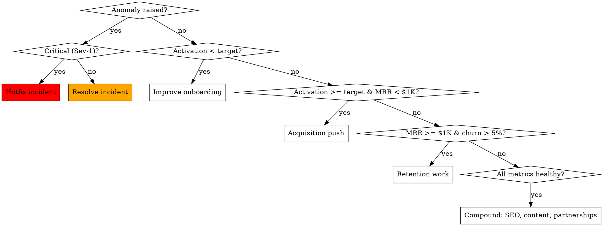

# Atlas Growth Engine — The Perpetual Co-Founder Loop

**Input:** Live product + post-launch metrics + state from `~/.atlas/portfolio/[slug]/context.json`
**Output:** Continuous, measurable forward motion on the business until it sustains itself.

## The Iron Rule of Growth

A launched product that nobody is operating is a graveyard.

Every successful indie business is a chain of weekly cycles: **measure → decide → act → ship → measure**. Founders fail not because they can't build, but because they can't sustain the cycle.

**Atlas IS the cycle.** Atlas does not let the cycle break.

Phase 11 runs perpetually. Every `/atlas`, every weekly cron tick, every `/atlas growth` invocation — Atlas runs one full loop and writes evidence of forward motion to `growth_log.md`. If the founder skips a week, Atlas catches up. If the founder vanishes for a month, Atlas keeps the lights on and resumes momentum on return.

---

## The Weekly Loop (5 Stages)

```
Loop start:  Monday 09:00 local (founder's TZ from context.json)
Loop length: ~30 min Atlas-time, < 15 min founder-time

11.1 Pulse      Pull metrics; compute deltas; surface anomalies
11.2 Decide     Choose THIS WEEK'S highest-leverage action (one)
11.3 Execute    Atlas does the action (or queues it for human if irreducible)
11.4 Ship       Push, deploy, post, send — verify it landed
11.5 Log        Write to growth_log.md, update context.json, regenerate dashboard
```

The cycle repeats forever or until `/atlas retire`.

---

## 11.1 Pulse — Metrics Pull

Every loop starts here. Atlas reads from every configured source:

| Source | What's pulled | API/CLI used |
|--------|---------------|--------------|
| Stripe | MRR, new MRR, churned MRR, failed payments, trial conversions | Stripe API + STRIPE_SECRET_KEY |
| PostHog/Mixpanel/Plausible | Visitors, signups, activation rate, top pages, bounce | Their respective APIs |
| Sentry | New errors, error rate, top error groups | Sentry API |
| Better Uptime / UptimeRobot | Uptime %, response time, downtime incidents | API |
| Email tool (Resend/Loops/ConvertKit) | List growth, open rate, click rate, unsubscribes | API |
| GitHub | Issues opened, PRs, stars (proxy for org buzz) | gh CLI |
| Search Console | Impressions, clicks, top queries, indexed pages | Search Console API |
| Twitter/X | Profile growth, top tweet, replies awaiting response | Twitter API v2 |
| Product Hunt | Continued upvotes/comments on launch post | PH GraphQL |
| Stripe payment failures | Customers requiring dunning | Stripe API |
| Support inbox | Unresolved threads, common themes | Crisp/Intercom API or IMAP |

For each unconfigured source: Atlas surfaces a `userMust` to wire it (only on first loop after launch — not weekly).

### Snapshot Output

`~/.atlas/portfolio/[slug]/metrics/snapshot_<YYYY-MM-DD>.json`

```json
{
  "date": "2026-05-19",
  "week_index": 3,
  "current": {
    "mrr": 412,
    "active_users": 87,
    "activation_rate": 0.31,
    "uptime_7d": 0.9994,
    "error_rate_7d": 0.0011,
    "list_size": 1240,
    "top_traffic_source": "twitter",
    "top_landing_page_drop_off": "/pricing"
  },
  "deltas_vs_last_week": {
    "mrr_pct": 0.18,
    "active_users_pct": 0.22,
    "activation_rate_pct": -0.04,
    ...
  },
  "anomalies": [
    {"metric": "activation_rate", "delta": -0.04, "severity": "warn", "trigger": "drop > threshold"},
    {"metric": "error_rate", "delta": 0.0008, "severity": "info"}
  ]
}
```

### Anomaly Detection

Atlas compares to:
- Last week (week-over-week)
- Trailing 4-week average (smooths noise)
- Phase 12-defined thresholds

If a metric crosses an action threshold, Atlas raises an **incident** to `~/.atlas/incidents/` and the loop's Decide step prioritizes that incident over the default plan.

---

## 11.2 Decide — One Action per Week

Most founders fail because they try to do five things and finish none. Atlas chooses **one** action per loop, ranked by Impact × Confidence ÷ Effort.

### The Decision Tree



### Action Library (What Atlas Picks From)

Each action below has a fully-defined execution recipe Atlas follows.

**Acquisition actions:**
- Schedule + post 7 platform-specific pieces of content (calls Phase 6's repurpose.ts on a pillar)
- Send 10 personalized cold DMs to fresh micro-influencers (queue from Phase 6 list)
- Publish 1 SEO-targeted long-form post (from Phase 6's content roadmap, fully drafted)
- Submit product to 1 directory (BetaList, AlternativeTo, SaaSHub, ProductHunt Ship, etc.)
- Pitch 5 podcasts (calls a podcast-fit search, drafts 5 personalized pitches)
- Run a Reddit AMA prep + post (uses Audience Map's top sub)
- Publish a comparison page (vs. specific competitor) optimized for "X vs Y" searches
- Cross-promote with a complementary tool (drafts the partnership email)

**Retention/Activation actions:**
- A/B test landing hero copy (commits feature flag, runs for 7 days)
- Rewrite onboarding email sequence using last week's drop-off data
- Add an in-app prompt at the drop-off step (commits the component)
- Email re-activation campaign to 30+ day inactive users
- Ship a "missing feature" identified from support tickets
- Add product analytics events at the activation moment (so we can measure further)
- Publish a "how to" tutorial keyed to the drop-off step

**Revenue actions:**
- Send dunning emails to failed-payment customers (executed via Stripe API)
- Launch a limited-time annual upgrade offer (commits the pricing variant + email)
- Add a yearly plan if not present (commits Stripe price + UI)
- Reach out to top 5 power users with a paid-tier-relevant ask
- Add an "upgrade nudge" at a feature-gated moment (commits component + analytics)

**Iteration actions:**
- Ship the most-requested feature from support tickets (Atlas codes it)
- Fix the top Sentry error group (Atlas reads, fixes, deploys)
- Speed up the slowest page if Core Web Vitals are red (Atlas runs LCP optimization)
- Refactor the highest-bounce page (Atlas rewrites copy, redeploys)

**Compound actions (when all metrics are healthy):**
- Apply for one new startup credits program (carry over from Phase 7 if any remain)
- Begin a partnership pipeline (drafts 3 partnership outreach emails)
- Publish an open-source helper related to the product (lead-gen + credibility)
- Submit a guest post to a niche publication (Atlas drafts, founder approves)
- Run a free workshop / webinar (Atlas drafts script + landing + email invite)

### Action Selection Output

```yaml
WEEK 3 ACTION DECISION

Selected action: "Improve onboarding — fix /pricing drop-off"
Reasoning: |
  Activation dropped 4 pts WoW; PostHog shows 62% of /pricing visitors leave without
  scrolling past the fold. Top exit page in funnel. Highest leverage available this week.
Predicted impact: +6-10 pts activation if hypothesis (price anchoring confusion) is correct
Confidence: Medium (anchored to PostHog drop-off data)
Effort: 4 hours Atlas time, 0 hours founder time
Success metric: activation_rate next Monday > 0.33
Failure exit: if next Monday activation < 0.30, revert and pick next decision

Deferred actions (queued for future weeks):
  - Add yearly plan (waiting on revenue threshold)
  - Pitch 5 podcasts (queued for week 5 — needs a metric milestone first)
```

---

## 11.3 Execute — Atlas Does The Action

For each action category, Atlas has a complete execution recipe. Examples:

### Recipe: "Schedule + post 7 platform-specific pieces of content"

```
1. Read context.json: this week's pillar topic from CONTENT_CALENDAR_90.md
2. Run scripts/repurpose.ts <pillar-url> — produces 7 derivative pieces
3. For each piece:
   a. Self-review against BRAND_VOICE.md (forbidden words check)
   b. Schedule via Typefully/Buffer/Hypefury API
   c. Verify 200 response from API
   d. Record scheduled_at + platform_post_id in CONTENT_CALENDAR_90.md
4. If API call fails: log incident, fall back to paste queue, surface userMust
5. Log to growth_log.md: "Week 3 — scheduled 7 posts across [platforms]; expected reach [X]"
```

### Recipe: "Send 10 personalized cold DMs to fresh micro-influencers"

```
1. Read OUTREACH_QUEUE.md: pull next 10 unsent items
2. For each:
   a. Re-verify their recent post still relevant (web fetch their profile)
   b. Personalize message with this week's product update if applicable
   c. Send via platform API if creds present, else queue for paste
   d. Record sent_at + reply_check_due (sent_at + 7 days)
3. After 7 days: Atlas checks reply status; sends follow-up if no reply
4. Track conversion: "DMs sent → replies → calls → signups → paid"
5. Log to growth_log.md
```

### Recipe: "Hotfix Sentry top error group"

```
1. Pull top error group from Sentry API: stack trace, occurrences, affected users
2. Reproduce locally (read code, identify root cause)
3. Write fix
4. Add a regression test
5. Commit with descriptive message
6. Run test suite — must pass
7. Push to main; auto-deploy fires
8. Verify: curl healthcheck; Sentry shows no new occurrences in 1 hour
9. Mark error as resolved in Sentry (API)
10. Log to growth_log.md
```

### Recipe: "Email re-activation campaign to 30+ day inactive users"

```
1. Query DB: users where last_active_at < now() - 30d AND not unsubscribed
2. Segment: free vs paid; recent activity tier
3. Draft 3 emails (different angles for each segment)
4. Send via email API
5. Wait 24h; pull open/click/reactivation metrics
6. Log to growth_log.md
```

Each recipe handles failures with the universal Self-Healing Protocol.

---

## 11.4 Ship — Verify It Actually Landed

**Action without verification is not action.** Every Phase 11 action ends with proof.

| Action type | Verification |
|-------------|--------------|
| Code change | Test passes; deploy succeeds; healthcheck 200; specific feature curl-tested |
| Content scheduled | API returns scheduled_id; Atlas curls scheduled URL on the date |
| Email sent | API returns delivery confirmation; sample address shows received |
| Outreach DM sent | Platform API confirms or paste-queue marked done by founder |
| Pricing change | Stripe API confirms new price; landing page reflects it |
| A/B test launched | PostHog/Mixpanel API confirms experiment is live with traffic |

If verification fails: action is **not** logged as complete; self-healing engages.

---

## 11.5 Log — Write Forward Motion to Disk

`~/.atlas/portfolio/[slug]/growth_log.md` — append-only chronological log.

```markdown
## Week 3 — 2026-05-19

**Pulse:**
- MRR: $412 (+18% WoW)
- Activation: 31% (-4pp WoW) ⚠ anomaly
- Uptime: 99.94%
- List: 1240 (+82)

**Decision:** Fix /pricing drop-off (activation regression)

**Executed:**
- Identified: pricing page exit rate 62% pre-fold (PostHog event #4421)
- Hypothesis: anchor pricing too high without value framing
- Shipped: rewrote pricing hero, added "what you get" before price; deploy 09b4f2a
- Deployed: 2026-05-19T14:02 UTC
- Verified: /pricing returns 200; new copy live; PostHog tracking new pricing_view event

**Predicted check:** Next Monday — activation_rate target 0.33

**Time on loop:** 47 min Atlas, 0 min founder

---

## Week 4 — 2026-05-26

**Pulse:** ...
```

### State Updates

Atlas also updates:
- `context.json` — runs-itself score, current phase, last action
- `dashboard.html` — refreshes the displayed state
- `metrics/snapshot_<date>.json` — new snapshot
- `decisions.md` — entry for this week's decision

Atomic writes per the Self-Healing Protocol's atomic-write rule.

---

## Cron Layer (Atlas Runs Itself)

Phase 11 commits a GitHub Action that runs the loop on a schedule, even when the founder is away.

```yaml
# .github/workflows/weekly-review.yml
name: Atlas Weekly Growth Loop
on:
  schedule:
    - cron: "0 17 * * 1"   # Mondays 09:00 PST = 17:00 UTC
  workflow_dispatch:

jobs:
  growth-tick:
    runs-on: ubuntu-latest
    steps:
      - uses: actions/checkout@v4
      - name: Pull metrics
        run: node scripts/atlas/pulse.js > /tmp/pulse.json
        env:
          STRIPE_SECRET_KEY: ${{ secrets.STRIPE_SECRET_KEY }}
          POSTHOG_API_KEY: ${{ secrets.POSTHOG_API_KEY }}
          # ...
      - name: Open growth-loop PR
        run: node scripts/atlas/open_pr.js /tmp/pulse.json
        env:
          GITHUB_TOKEN: ${{ secrets.GITHUB_TOKEN }}
      - name: Notify founder
        run: node scripts/atlas/notify.js
        env:
          DISCORD_WEBHOOK: ${{ secrets.DISCORD_WEBHOOK }}
```

`scripts/atlas/pulse.js`, `open_pr.js`, `notify.js` — Atlas commits these in Phase 11's first run.

The PR contains:
- This week's metrics snapshot (committed to `~/.atlas/...` mirror in repo)
- The decision Atlas would make
- The proposed action's diff if it's a code change

The founder reviews + merges, OR replies "go" in Discord and Atlas merges itself, OR ignores it for 24h and Atlas merges if the action is in a pre-approved category.

---

## Pre-Approved Action Categories (Auto-Merge)

To prevent the founder becoming a bottleneck, Phase 11 establishes pre-approval scopes the founder signs once at Phase 11 start:

```yaml
# config/atlas-permissions.yml — committed, founder edits

pre_approved:
  - schedule_content_via_api    # always-on
  - send_outreach_to_queued_list_under_n_per_day: 10
  - hotfix_sentry_critical      # error group with > 50 occurrences/day
  - hotfix_p0_in_open_incident  # already-flagged failures
  - dunning_emails_via_stripe   # failed payment recovery
  - publish_seo_post_from_roadmap
  - schedule_email_drip_to_segment
  - update_meta_tags_and_seo
  - reactivation_email_to_inactive_30d

requires_explicit_approval:
  - pricing_changes
  - public_announcements_outside_calendar
  - content_about_competitors_by_name
  - any_partnership_email
  - investor_communications
  - paid_ads_above_n_per_week: 50

never:
  - delete_user_data
  - issue_refunds_above_n: 100
  - change_legal_pages
  - delete_production_resources
  - send_to_more_than_n_recipients_at_once: 5000
```

This is the **trust contract** — Atlas operates aggressively inside its lane, defers carefully outside it.

---

## Edge Cases & Failure Modes

| Scenario | Atlas Response |
|----------|----------------|
| No metrics available (APIs down) | Use last snapshot; reduce confidence on decision; surface the data gap as the action |
| Founder hasn't reviewed PR in 7 days | Auto-merge if pre-approved; escalate via Discord if requires approval; never block on missing approval forever |
| All metrics flat for 4+ weeks | Trigger a "stagnation special" — Atlas runs a 5-channel acquisition sprint AND a customer interview drive |
| MRR drops > 25% in a week | Sev-1 incident; Atlas pauses normal loop, triggers retention emergency, drafts customer interview outreach |
| Founder runs `/atlas growth` mid-week | Run the partial loop (Pulse + Decide + Execute); skip the 11.4/11.5 cron-specific bits; resume on Monday |
| Founder runs `/atlas growth` and there's no completed Phase 10 | Refuse with: "War Room (Phase 10) hasn't completed. Run /atlas warroom first." |
| 3+ failed actions in a row | Atlas pauses execution; surfaces a recap to the founder; asks for direction |
| Action is in `requires_explicit_approval` and founder is unreachable | Atlas does the **next-best safe action** instead, logs the deferred one |
| Action requires money the founder doesn't have | Atlas falls back to the cheapest equivalent, surfaces a userMust if the gap is critical |
| Two competing anomalies | Pick the one with worst impact-on-business; document the choice in decisions.md |
| Founder explicitly says "stop" | Atlas pauses Phase 11; commits to context.json; resumes on next /atlas |

---

## Output Files (Phase 11 — first run + recurring)

```
~/.atlas/portfolio/[slug]/
├── growth_log.md               (append-only)
├── decisions.md                (append-only)
├── metrics/
│   ├── snapshot_YYYY-MM-DD.json (one per loop)
│   └── trends.json             (rolling 4-week)
└── incidents/                  (anomaly-driven)

scripts/atlas/
├── pulse.js
├── decide.js
├── execute_<recipe>.js   (one per action recipe)
├── ship.js
├── log.js
├── open_pr.js
└── notify.js

.github/workflows/
└── weekly-review.yml

config/
└── atlas-permissions.yml

docs/founder/
└── GROWTH_ENGINE.md            (overview for the founder + how to override)
```

---

## Acceptance Test (Phase 11 — first cycle)

Phase 11's first cycle must produce:

- [ ] One metrics snapshot file
- [ ] One decision recorded in decisions.md with reasoning
- [ ] One action executed end-to-end with verification
- [ ] One growth_log.md entry
- [ ] The cron workflow committed and visible in GitHub Actions UI
- [ ] config/atlas-permissions.yml committed with founder defaults
- [ ] At least one pre-approved category exercised successfully

For perpetual operation, the test on every subsequent cycle is:
- [ ] Last 7 days show ≥ 1 entry in growth_log.md
- [ ] Runs-itself score unchanged or higher

If 14 days pass with no log entries, Atlas treats it as a Sev-1 self-failure and escalates.

---

## Checkpoint (First-Run + Every Subsequent)

```
─────────────────────────────────────────────────────
GROWTH ENGINE — Week [N] Cycle Complete

Pulse:
  MRR: $[X] ([±%] WoW)
  Activation: [X]% ([±pp])
  [...]

Decision: [chosen action]
  Reasoning: [1-2 lines]
  Confidence: [low|medium|high]

Executed:
  ✓ [thing 1]
  ✓ [thing 2]

Verified: [PASS / FAIL with detail]

Logged to: growth_log.md

Runs-itself score: [X] → [Y]

Next loop: [date — auto-cron OR /atlas growth]

Founder action needed: [none | specific small ask]
─────────────────────────────────────────────────────
```

---

## Red Flags

- ❌ Phase 11 cycle that doesn't write a snapshot file
- ❌ "I would do X this week" without actually doing X
- ❌ More than one primary action selected (focus is the whole point)
- ❌ Executing an action that requires explicit approval without approval
- ❌ Skipping verification because "it probably worked"
- ❌ Letting growth_log.md go quiet for 14+ days without escalating
- ❌ Pulling metrics but ignoring an anomaly
- ❌ Picking a "compound" action when an anomaly demands attention
- ❌ Failing to commit the cron workflow on first cycle
- ❌ Treating Phase 11 as optional — it's the entire point of the post-launch product
- ❌ Promising the founder a result without a measurable success metric + failure exit
- ❌ Letting an action run > 7 days without checking back
