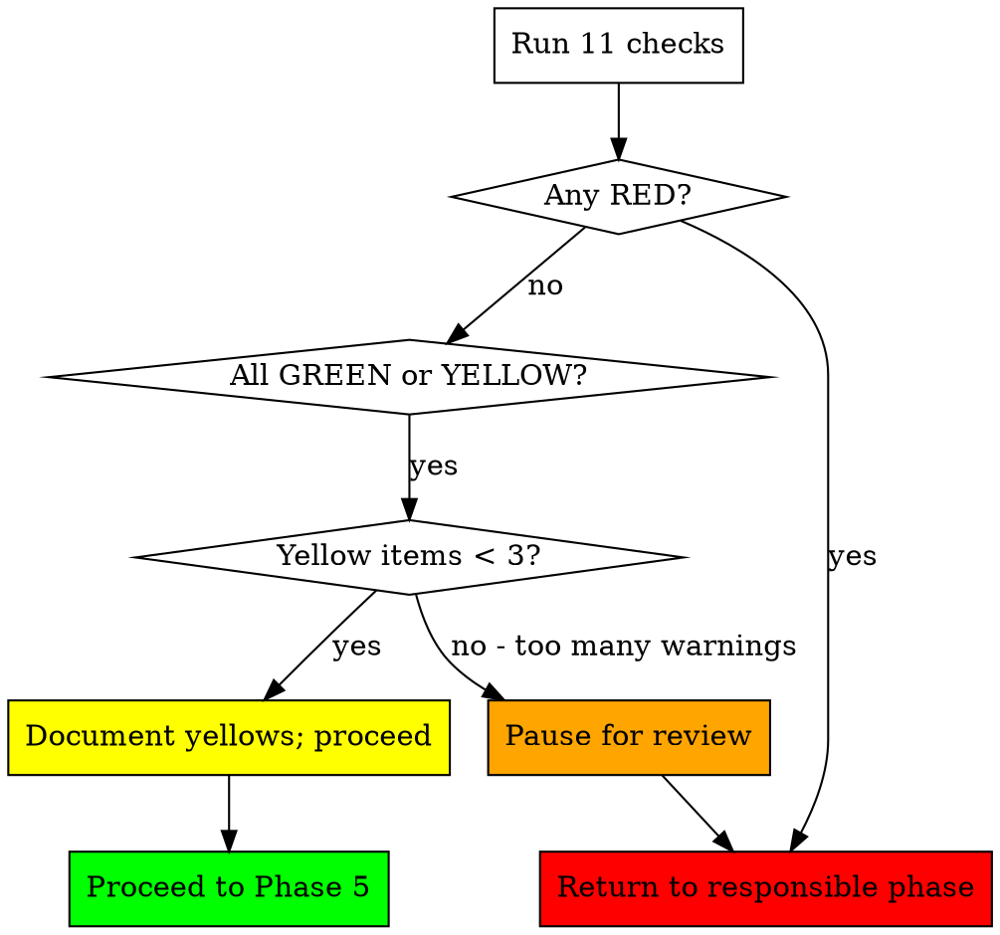

# Atlas Pre-Flight — The Launch Gate

**Input:** Production deployment + state from prior phases
**Output:** Either GREEN (proceed to Phase 5+) or a specific phase to revisit

## The Iron Rule

**Atlas does not let a broken product launch.**

Pre-Flight is the only phase that can send Atlas backward. If a check fails, Atlas returns to the phase responsible (Code Sprint, Legal, Automation) and fixes it before continuing. Forward motion is conditional on safety.

The cost of a delayed launch is one day. The cost of a broken launch is the entire launch.

---

## The 11 Pre-Flight Checks

| # | Check | Method | Pass Criteria |
|---|-------|--------|---------------|
| 1 | Production URL responsive | `curl -sf <prod>/` | 200 status, body > 1KB |
| 2 | Healthcheck endpoint live | `curl -sf <prod>/api/health` | 200, JSON `{"status":"ok"}` |
| 3 | Auth flow end-to-end | Playwright test (signup → confirm → login) | Completes in < 30s |
| 4 | Payment flow end-to-end | Stripe test mode: signup → checkout → succeed | Webhook fires; receipt sent |
| 5 | Legal pages serve | `curl -sf <prod>/terms`, `/privacy` | 200 each, body > 500B |
| 6 | Email delivery works | Send test email via configured provider | Confirms delivery within 60s |
| 7 | Error monitoring fires | Trigger synthetic error via test endpoint | Sentry shows new event within 60s |
| 8 | Uptime monitoring active | Better Uptime / UptimeRobot dashboard check | Monitor exists, status = up |
| 9 | DNS, SSL, security headers | `curl -I <prod>` + ssl-labs API | A grade SSL; security headers present |
| 10 | Rollback procedure tested | Run `scripts/rollback.sh` in staging | Completes; previous version live in staging |
| 11 | Mobile responsiveness | Lighthouse via chrome-devtools-mcp on `/` | Mobile score ≥ 80 |

---

## Detailed Check Procedures

### Check 1: Production URL Responsive

```bash
PROD_URL=$(jq -r .product.production_url ~/.atlas/portfolio/[slug]/context.json)
HTTP_CODE=$(curl -s -o /tmp/body.html -w "%{http_code}" "$PROD_URL")
SIZE=$(wc -c < /tmp/body.html)

if [ "$HTTP_CODE" != "200" ] || [ "$SIZE" -lt 1024 ]; then
  echo "FAIL — code=$HTTP_CODE size=$SIZE"
  # Send back to Phase 2 (Code Sprint)
fi
```

**Failure modes:**
- 502/503: deployment incomplete → return to Phase 2
- 200 but body < 1KB: SSR not rendering → return to Phase 2
- DNS error: domain not configured → userMust + return to Phase 2

### Check 2: Healthcheck Endpoint

If `/api/health` doesn't exist, Atlas commits one in Phase 2:

```typescript
// app/api/health/route.ts
export async function GET() {
  const checks = {
    db: await pingDatabase(),
    cache: await pingCache(),
    timestamp: new Date().toISOString(),
  };
  const allOk = Object.values(checks).every(v => v === true || typeof v === 'string');
  return Response.json(
    { status: allOk ? 'ok' : 'degraded', checks },
    { status: allOk ? 200 : 503 }
  );
}
```

### Check 3: Auth Flow E2E

Playwright script Atlas commits as `tests/e2e/auth.spec.ts`:

```typescript
test('signup → email confirm → login', async ({ page }) => {
  const email = `preflight+${Date.now()}@example.com`;
  await page.goto('/signup');
  await page.fill('[name=email]', email);
  await page.fill('[name=password]', 'PreflightTest!2026');
  await page.click('[type=submit]');
  await expect(page).toHaveURL(/dashboard|verify/);
  // ... continues through full flow
});
```

If the test fails: Atlas reads the failure, returns to Code Sprint to fix the specific broken step.

### Check 4: Payment Flow E2E

```bash
# Use Stripe test mode
stripe trigger checkout.session.completed --override checkout_session:metadata[preflight]=true
# Verify webhook handler ran
curl -s "$PROD_URL/api/health/last-webhook" | jq .processed_at
```

If webhook didn't fire: deployment is missing webhook endpoint OR Stripe webhook secret is wrong. Return to Phase 2 / 8.

### Check 5: Legal Pages Serve

```bash
for path in /terms /privacy /cookie-policy; do
  CODE=$(curl -s -o /dev/null -w "%{http_code}" "$PROD_URL$path")
  [ "$CODE" = "200" ] || echo "FAIL: $path returned $CODE"
done
```

If 404: legal pages were generated but routes weren't committed. Return to Phase 3.

### Check 6: Email Delivery

Atlas sends a test email via the configured provider (Resend/SendGrid/Loops) and verifies delivery via the provider's API. If the founder's email isn't accessible, Atlas uses a disposable test address it can poll (e.g., mailsac.com API).

### Check 7: Error Monitoring

```bash
# Trigger synthetic error
curl -X POST "$PROD_URL/api/test/synthetic-error" -H "X-Preflight: true"

# Wait 60s for Sentry to ingest
sleep 60

# Query Sentry API
curl -H "Authorization: Bearer $SENTRY_AUTH_TOKEN" \
  "https://sentry.io/api/0/projects/$ORG/$PROJ/events/?query=preflight" | jq
```

The synthetic error endpoint is gated behind a header so attackers can't hammer it. Atlas commits both the endpoint and the test.

### Check 8: Uptime Monitoring

Verify a monitor exists for production URL:

```bash
curl -H "Authorization: Bearer $BETTER_UPTIME_API_KEY" \
  "https://uptime.betterstack.com/api/v2/monitors" | \
  jq ".data[] | select(.attributes.url == \"$PROD_URL\")"
```

If no monitor: Atlas creates one via API. If API key missing: userMust to add it; check temporarily marked YELLOW (warning, not blocker — but logs anomaly).

### Check 9: DNS, SSL, Security Headers

```bash
# SSL grade via Mozilla Observatory API or ssllabs API
curl -s "https://api.ssllabs.com/api/v3/analyze?host=$DOMAIN&fromCache=on&maxAge=24" | \
  jq .endpoints[0].grade

# Security headers
curl -sI "$PROD_URL" | grep -iE 'strict-transport-security|content-security-policy|x-frame-options|x-content-type-options|referrer-policy'
```

Required headers for pass:
- `Strict-Transport-Security` (HSTS)
- `X-Content-Type-Options: nosniff`
- `X-Frame-Options: SAMEORIGIN` (or CSP frame-ancestors)
- `Referrer-Policy`
- HTTPS enforced (HTTP redirects to HTTPS)

If missing: Atlas commits headers in framework's config file (next.config.js, etc.).

### Check 10: Rollback Procedure Tested

Atlas runs `scripts/rollback.sh` against a staging environment (or against production with immediate rollforward to verify the round trip works). If staging doesn't exist: Atlas creates a Vercel preview deployment, runs the rollback script against it.

This catches the worst failure mode of all: rollback breaks when you actually need it.

### Check 11: Mobile Responsiveness

Uses chrome-devtools-mcp's lighthouse_audit if available, else falls back to PageSpeed Insights API.

Pass: mobile score ≥ 80. Below 80: Atlas calls `chrome-devtools-mcp:debug-optimize-lcp` skill to fix top issues, then retests.

---

## Output: PRE_FLIGHT_CHECKLIST.md

```markdown
# Pre-Flight Checklist — [Product] — 2026-05-11

| # | Check | Status | Detail | Time |
|---|-------|--------|--------|------|
| 1 | Production responsive | ✅ GREEN | 200 / 4.2KB | 142ms |
| 2 | Healthcheck | ✅ GREEN | /api/health 200 | 89ms |
| 3 | Auth E2E | ✅ GREEN | signup→login 14.2s | OK |
| 4 | Payment E2E | ⚠ YELLOW | webhook arrived 1.4s slow | OK |
| 5 | Legal pages | ✅ GREEN | /terms /privacy /cookie 200 | OK |
| 6 | Email delivery | ✅ GREEN | Resend confirmed @ 3.1s | OK |
| 7 | Error monitoring | ✅ GREEN | Sentry event id ABC123 | OK |
| 8 | Uptime monitoring | ✅ GREEN | BetterUptime monitor #5523 | OK |
| 9 | SSL + headers | ✅ GREEN | Grade A; all 5 headers present | OK |
| 10 | Rollback test | ✅ GREEN | Reverted to v0.4.2 in 38s | OK |
| 11 | Mobile responsive | ✅ GREEN | Lighthouse mobile = 87 | OK |

OVERALL: 🟢 GREEN — cleared for Phase 5

Yellow items (warnings, not blockers):
- Stripe webhook latency 1.4s — monitor; add alert if > 5s

Atlas next action: Phase 5 (Launch Strategy)
```

---

## Decision Tree After Pre-Flight



### Severity Mapping

- **RED** = blocks launch entirely
- **YELLOW** = launch can proceed; logged to incidents/ for Phase 11 to address in next loop
- **GREEN** = clean

3+ yellows = Atlas pauses and asks the founder, because patterns of warnings indicate systemic fragility.

---

## Acceptance Test (Phase 4)

- [ ] All 11 checks have run and produced a status
- [ ] PRE_FLIGHT_CHECKLIST.md exists with timestamps
- [ ] If any RED: phase returned to and re-Pre-Flight-tested before this checkpoint
- [ ] If any YELLOW: incident logged to `~/.atlas/incidents/`
- [ ] Launch is unlocked OR a specific reason is logged for the block

---

## Checkpoint

```
─────────────────────────────────────────────────────
PRE-FLIGHT [GREEN | YELLOW | RED]

Checks: [N green / N yellow / N red]

[If GREEN:]
  ✅ Cleared for Phase 5 — Launch Strategy
  Continuing automatically.

[If YELLOW with < 3:]
  ⚠ Proceeding with warnings logged
  Yellows: [list with severity]
  Continuing to Phase 5; Phase 11 will address.

[If YELLOW with >= 3, or RED:]
  🛑 Launch BLOCKED
  Failures: [specific list]
  Atlas returning to Phase [N] to fix.

Runs-itself score: [X] (no change in this gate phase)

Type 'override preflight' to proceed despite warnings (logged + signed by founder).
Type 'continue' to proceed if cleared.
─────────────────────────────────────────────────────
```

---

## Red Flags

- ❌ Skipping any of the 11 checks
- ❌ Marking a check green without running the actual command
- ❌ Proceeding to Phase 5 with any RED
- ❌ Letting the rollback test be theoretical instead of actually exercised
- ❌ Treating yellows as immaterial (they're future RED)
- ❌ Not testing payment in actual Stripe test mode (synthetic success isn't validation)
- ❌ Skipping mobile check because "we'll polish later" — half of launch traffic is mobile
- ❌ Failing to log the test results to disk for the post-launch retro
